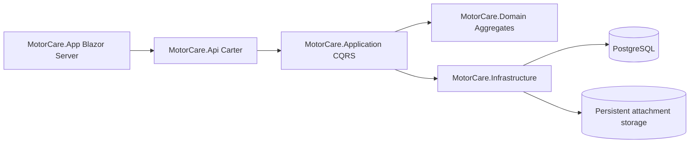
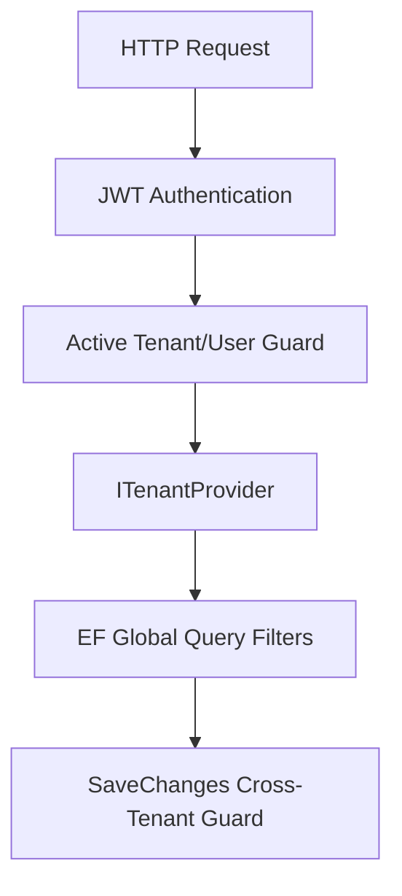

# MotorCare / GarajPass SaaS MVP Technical Specification

Date: 2026-05-21

## Goal

Ship GarajPass as a web-first SaaS MVP for small and mid-sized vehicle service shops. The product must be safe for multi-tenant production use before Portainer production deployment.

## Current Baseline

- Backend: .NET 8, Carter, MediatR, FluentValidation, EF Core/Npgsql.
- Frontend: .NET 8 Blazor Server web app in `src/MotorCare.App`.
- Architecture: Clean Architecture with Domain, Application, Infrastructure, API, App.
- Current verified state: `dotnet build` succeeds and 99 unit tests pass.

## MVP Scope

Must ship:

- Tenant registration with owner account and email verification.
- Tenant-scoped login, refresh token, 2FA, forgot/reset password.
- User invitations, role management, active/inactive user guard.
- Customer, vehicle, service order, labor, parts, consumables, payments, discounts.
- Appointments, service catalog, inventory, inspections.
- Public QR service and inspection records.
- Dashboard, payment summary, open balances.
- Import center.
- Staging and production Portainer stack definitions.

Not in this MVP:

- Native MAUI client.
- Offline-first sync.
- Full subscription billing gateway integration.
- Fleet-management expansion.

## Architecture Decisions

Decisions:

- Web-first MVP. MAUI remains a future client, not a launch blocker.
- Tenant context must be derived from authenticated token in production.
- `X-Tenant-Id` is allowed only as an explicitly configured non-production/internal fallback.
- Password reset and email security flows are tenant-scoped.
- Portainer deployment is allowed only after build, tests, review and smoke gates pass.

## Sprint Implementation Plan

### Sprint 1: Backend SaaS Hardening

- Harden tenant context and remove unsafe production header fallback.
- Validate JWT and SMTP configuration at startup.
- Make password reset tenant-scoped.
- Add rate limiting for auth public endpoints.
- Lock down tenant-management endpoints to current-tenant profile use or platform-only access.
- Add focused unit tests for auth and tenancy behavior.

### Sprint 2: Frontend Auth and Onboarding

- Add central auth/route guard for protected Blazor pages.
- Separate 401 session expiry from 403 forbidden UX.
- Align role-aware action visibility with backend capabilities.
- Add access-token refresh retry.
- Add first-run onboarding checklist.
- Hide or gate placeholder MVP-out pages.

### Sprint 3: CI, Storage and Release Readiness

- Add GitHub Actions CI for restore, build, test and Docker build.
- Publish API Docker artifact instead of copying build output.
- Make service-order attachment storage persistent in compose stacks.
- Update backup/restore runbooks to include uploads.
- Add readiness/health checks suitable for deployment gates.

### Sprint 4: Staging UAT and Portainer

- Align staging migrator behavior with deployment documentation.
- Run staging auth/email/password-reset smoke.
- Run role matrix and core business smoke.
- Update Portainer env templates and release runbooks.
- Deploy to staging only after green gates.

### Sprint 5: Production Launch

- Verify production secrets, SMTP, DNS/TLS, backups and monitoring.
- Run production preflight smoke.
- Deploy production Portainer stack only after explicit deploy gate is green.

## Definition of Done

- `dotnet build src/MotorCare.sln -c Release` passes.
- `dotnet test src/MotorCare.sln -c Release` passes.
- CI workflow is present and mirrors local release gates.
- Staging compose validates with `docker compose config`.
- Attachment uploads survive container recreation by using persistent storage.
- Tenant isolation and auth flows are covered by tests or smoke scripts.
- Portainer deployment artifacts are updated and documented.
